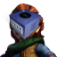
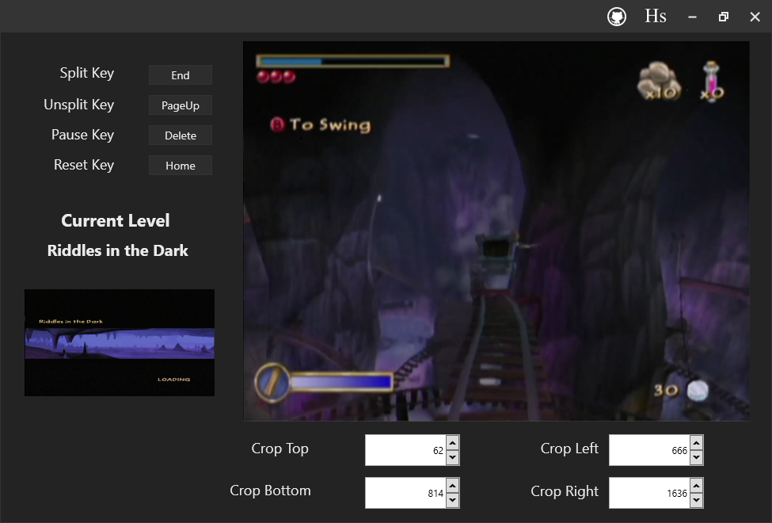

[![Commits Activity][commits-shield]][commits-url]
[![Forks][forks-shield]][forks-url]
[![Stargazers][stars-shield]][stars-url]
[![Issues][issues-shield]][issues-url]
[![MIT License][license-shield]][license-url]

<!-- PROJECT LOGO -->
 

  

<h2 align="center"><b>Hobbit Autosplitter</h3></b>

  

    <i>A speedrunning tool for the console version of the game that automatically handles all livesplit interactions through image comparison!</i>
     
    <a href="https://hobbitspeedruns.com/"><strong>Hobbit Speedruns Website »</a>
     
     
    
    <a href="https://www.youtube.com/watch?v=hQ-PaTFFdN0">Installation Video</a>
    ·
    <a href="https://github.com/Shockster218/Hobbit-Autosplitter/issues">Report Bug</a>
    ·
    <a href="https://github.com/Shockster218/Hobbit-Autosplitter/issues">Request Feature</a></strong>
  

  
Table of Contents

  <ol>
    <li><a href="#about">Why should I use Hobbit Autosplitter?</a></li>
    <li>
      <a href="#getting-started">Getting Started</a>
      <ul>
        <li><a href="#Prerequisites">What you're gonna need.</a></li>
        <li><a href="#Usage">How do I use it?</a></li>
        <li><a href="#Things-to-Remember">A few things to keep in mind!</a></li>
      </ul>
    </li>
    <li><a href="#known-issues">Known Issues</a></li>
    <li><a href="#contact-me">Have a problem?</a></li>
    <li><a href="#credits">Credits</a></li>
  </ol>

 

# About
Tired of having to reach over and split during a run? Want to have a great estimate of your loadless time instantly after completing your run? Hobbit Autosplitter was made with all these issues in mind; never
have to worry about taking your hands off the controller during your best runs. With an average variance of less than half a second, Hobbit Autosplitter will consistently and quickly give you real-time feedback
of your run with **loadless times**. Hobbit Autosplitter was made with any and all categories in mind, even including support for mid-level checkpoints, such as the Thief Split for any% NMG. 

  

(<a href="#top">back to top</a>)

# Getting Started
Getting the autosplitter up and running requires a little bit of setup that takes some time but is extremely easy to do. There are a few things you'll need before we start.

## Prerequisites
* Up-to-date version of [Livesplit](https://livesplit.org/downloads/).
* A game capturing/streaming program, such as [OBS Studio](https://obsproject.com/download).
* Image files of the loading screens from your setup (more on how to get these later).

## Usage
You can learn about how to use Hobbit Autosplitter following the installation video found [here](https://www.youtube.com/watch?v=hQ-PaTFFdN0). If you are unable to watch this video for whatever reason, you can follow the written instructions below. Make sure you follow all instructions carefully and thoroughly to ensure Hobbit Autosplitter works the best and to its full capability. Please also make sure to read all of the <a href="#known-issues">known issues</a>.

1. Download the [latest version](https://github.com/Shockster218/Hobbit-Autosplitter/releases/tag/v1.0.0-phash) of Hobbit Autosplitter, which is found at the toward the top right of this page. Once downloaded, extract the Hobbit Autosplitter folder to anywhere on your computer.

2. Before starting the executable, locate the splits folder within the program. This is found by first opening "Assets" folder and then "Splits" folder respectively. Included are the images necessary for the autosplitter to function, *however* they are from my setup. This next step is ***extremely important***. Replace each image you see in the folder with the corresponding image from your setup (in jpg, png, or bmp format), making sure to number them in the same order I have as and as the levels appear throughout the run. Even if you do not plan on using thief split, it's important you include it for the functionality of the program.
 *Note: It's ok to include other things in this image other than
gameplay such as livesplit, we will crop this out later.* 
For images 0, 9 and 14 (the main menu, thief split and the end of clouds burst respectively), those are to be ***the first*** frame each occur; for the main menu its the first frame **"Press START"** is visible, for thief split it's the first frame of the cutscene that happens when you trigger the thief quest, and for the end of clouds burst its the first frame after you trigger the final barrel. The easiest way to obtain screenshots are by loading a previous PB in a video editor such as [VirtualDub2](https://sourceforge.net/projects/vdfiltermod/), going to the desired frame, and grabbing the screenshot from there.

3. Next, start the executable. If you did the previous step incorrectly, you'll recieve an error message describing the problem which needs to be addressed to continue. If you still face problems, feel free to <a href="#contact">contact me</a>. When the program is correctly started, you'll notice that none of the buttons are interactable and that the "Current Level" is "Waiting for OBS". Obviously, this is the point you want to open up OBS.
 *Note: You can have OBS opened prior to having Hobbit Autosplitter open and it will detect that it's open.* 

4. Now, this is where we adjust crucial settings for the program to accurately pinpoint correlations between the reference image and live feed. First, we have to adjust the live feed which shows the entirety of OBS. We are going to have to crop this feed to show the gameplay feed only. Below, there are 4 different boxes with numbers corresponding to the dimensions of OBS. Simple adjust those boxes by either typing values or using the up and down arrows (you might have to play around with them a bit) until the live feed only shows gameplay. **It is immensely important to get this is accurate and close to the edges as possible.** 

5. Next, if you look to the left of the live feed you will see an image corresponding to the current level or split Hobbit Autosplitter currently has active, which should be the Main Menu. Below that, is the "Change Comparison Crop" button. This is where you can crop the right or left of the image to remove unwanted parts which could affect the overall comparison. *Ex: livesplit or chat.*

6. This brings us to our last important section; the livesplit keybinds located at the top left. Simply click the button next to desired setting, then press the key on your keyboard that corresponds to the keybind you have on livesplit. Only split, unsplit, pause, and reset are necessary.
### Important settings in livesplit
* Check -> "Global Hotkeys"
* Uncheck -> "Double Tap Prevention"

7. Now Hobbit Autosplitter is ready to use!

## Things to Remember
Here are a few things to keep in mind when using the program.
* **Do not minimize OBS**. You can have OBS in the background with other windows on top of it, but minimizing OBS disallows Hobbit Autosplitter to read from the screen region.
* It is important to have this program open before reaching the Main Menu in The Hobbit. This is because of how Hobbit Autosplitter detects the menu for comparison to start. If you don't then Hobbit Autosplitter might not work as intended on the first run. However, this is completely fine! Upon entering dream world, simply exit back to the main menu. Hobbit Autosplitter should then detect the main menu properly!
* If the autosplitter splits but does not pause upon entering a new level, take a look at <a href="#Important-settings-in-livesplit">important settings in livesplit</a>.
* This is a community made project in my free time. If there's something wrong with the program, then please <a href="https://github.com/Shockster218/Hobbit-Autosplitter/issues">report the issue</a>.

(<a href="#top">back to top</a>)

# Known Issues
* Sometimes when starting Hobbit Autosplitter, even with OBS open you will see a black screen with no live video feed. If this happens, simply restart Hobbit Autosplitter until it picks up the live feed from OBS.
* Changing your OBS layout might effect the accuracy of Hobbit Autosplitter. In such a case where the program is affected, you are going to have to change the reference images to that which uses your new OBS layout.
* Changing the gamma (color correction filter) on the input device in OBS is known to cause the autosplitter to start inaccurately; later than intended to be exact. It should still work, it's just the first split will be incorrect due to a late start.

(<a href="#top">back to top</a>)

# Contact me
Having any issues that aren't stated on this page? Feel free to contact me!
* Add me on discord: shockster#1835 or message me in [The Hobbit Discord](https://discord.gg/uHRANWgUYZ).
* [![Twitter][twitter-shield]][twitter-url] Message me on twitter! 

(<a href="#top">back to top</a>)

# Credits
* [Shipwrecks Phash](https://github.com/pgrho/phash): Library used for Image Comparison.
* [MKarma](https://github.com/milankarman/): Inspiration and feedback.
* [AngryCarrot789](https://github.com/AngryCarrot789/WPFDarkTheme): Source code for dark theme. 

(<a href="#top">back to top</a>)

<!-- MARKDOWN LINKS & IMAGES -->
<!-- https://www.markdownguide.org/basic-syntax/#reference-style-links -->
[commits-shield]: https://img.shields.io/github/commit-activity/m/shockster218/Hobbit-Autosplitter/main?style=for-the-badge
[commits-url]: https://github.com/Shockster218/Hobbit-Autosplitter/commits/main
[forks-shield]: https://img.shields.io/github/forks/Shockster218/Hobbit-Autosplitter?style=for-the-badge
[forks-url]: https://github.com/Shockster218/Hobbit-Autosplitter/network/members
[stars-shield]: https://img.shields.io/github/stars/Shockster218/Hobbit-Autosplitter?style=for-the-badge
[stars-url]: https://github.com/Shockster218/Hobbit-Autosplitter/stargazers
[issues-shield]: https://img.shields.io/github/issues/Shockster218/Hobbit-Autosplitter?style=for-the-badge
[issues-url]: https://github.com/Shockster218/Hobbit-Autosplitter/issues
[license-shield]: https://img.shields.io/github/license/shockster218/Hobbit-Autosplitter?style=for-the-badge
[license-url]: https://github.com/Shockster218/Hobbit-Autosplitter/blob/main/LICENSE
[twitter-shield]: https://img.shields.io/twitter/url?style=social&url=https%3A%2F%2Ftwitter.com%2Fshockster__
[twitter-url]: https://twitter.com/shockster__